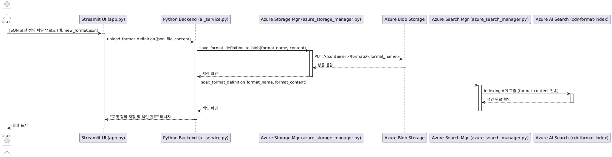
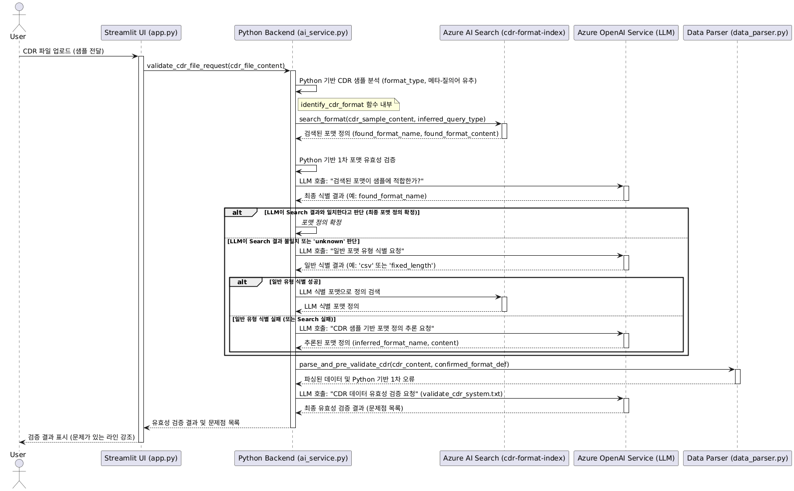

# project_7
MS AI과정 7기


# CDR 파일 연동 데이터 품질 모니터링 및 이상 탐지 
## AI활용 CDR 데이터 구조 분석 및 유효성 검증 : 

### 개요 (Overview)
이 프로세스의 주된 목적은 사용자가 정의한 CDR 파일의 구조(필드명, 데이터 타입, 길이 등)를 JSON 형태로 저장하고, 이후 이 정의를 AI가 효율적으로 검색하여 실제 CDR 파일을 분석하고 유효성을 검증할 때 활용하는 것입니다. 이를 위해 **Azure Blob Storage**와 **Azure AI Search**가 사용되며, 각각 파일의 영구 저장과 검색 엔진 역할을 수행합니다.

## 1. 시스템 개요

### 1.1. 문제 정의
통신 시스템에서 발생하는 CDR(Call Detail Record) 파일은 데이터 무결성과 정확성이 매우 중요합니다. 다양한 포맷과 대용량으로 인해 수동 검증은 비효율적이며 오류 발생 가능성이 높습니다. 본 프로젝트는 이 문제를 해결하기 위해 **Azure OpenAI Service, Azure AI Search, Azure Blob Storage**를 통합한 AI 기반 유효성 검증 시스템을 구축합니다. 이 시스템은 **Azure 서비스의 긴밀한 통합과 Python 기반의 정형 데이터 처리 능력(`data_parser.py`)을 활용**하여 CDR 데이터의 자동화된 포맷 식별 및 유효성 검증을 목표로 합니다.

### 1.2. 주요 목표
*   CDR 파일의 포맷을 AI(Azure OpenAI Service)가 자동으로 식별하거나 추론합니다.
*   식별된 포맷 정의를 기반으로 CDR 데이터의 유효성을 정확히 검증합니다.
*   **Azure 클라우드 서비스의 효과적인 통합과 `data_parser.py`를 통한 Python 로직 지원**으로 AI의 분석 정밀도를 높이고, 확장 가능하며 안정적인 데이터 처리 및 AI 기반 분석을 구현합니다.

---

## 2. CDR 포맷 정의 파일 등록 플로우

CDR 파일 유효성 검증을 위한 포맷 정의는 AI가 CDR 파일을 식별하고 검증하는 기준이 됩니다. 이 플로우는 사용자가 새로운 포맷 정의를 시스템에 등록하는 과정을 보여줍니다.

**[플로우 다이어그램 - 포맷 정의 등록]**
```
사용자 액션
      │
      V
[단계 1] JSON 포맷 정의 파일 업로드 (Streamlit UI)
      │
      V
[단계 2] app.py가 파일 내용 읽기
      │    (파일 이름: `format_name.json`, 내용: `format_content_str`)
      │
      V
[단계 3] ai_service.upload_and_index_format 호출 (담당: `ai_service.py`)
      │
      ├─────────────────────────► Azure Blob Storage 저장
      │                           (담당: `azure_storage_manager.py` -> Azure Blob Storage)
      │                           (포맷 정의 파일 원본(`format_content_str`) 영구 저장)
      │
      └─────────────────────────► Azure AI Search 색인
                                  (담당: `azure_search_manager.py` -> Azure AI Search)
                                  (JSON 파싱, Search 문서 생성, 인덱스에 업로드)
      │
      V
[단계 4] 포맷 정의 등록 성공/실패 알림 (Streamlit UI)
```


**상세 플로우 설명:**

1.  **JSON 포맷 정의 파일 업로드 (Streamlit UI)**:
    *   사용자가 Streamlit 웹 애플리케이션의 "CDR 포맷 정의 관리" 섹션에서 `.json` 확장자를 가진 포맷 정의 파일을 선택하고 업로드합니다.

2.  **`app.py`가 파일 내용 읽기**:
    *   `app.py`는 업로드된 파일의 이름(`format_name.json`)과 내용(`format_content_str`)을 읽어들여 임시적으로 저장합니다.

3.  **`ai_service.upload_and_index_format` 호출**:
    *   사용자가 `Azure Storage 및 AI Search에 저장` 버튼을 클릭하면, `app.py`는 `ai_service.py` 모듈의 `upload_and_index_format` 함수를 호출합니다. 이 함수는 포맷 정의를 저장하고 검색 가능하도록 색인하는 과정을 총괄합니다.

    *   **Azure Blob Storage 저장**: `ai_service.py`는 `azure_storage_manager.upload_format_definition` 함수를 통해 포맷 정의 파일의 원본 내용(`format_content_str`)을 **Azure Blob Storage**의 `cdr-format-definitions` 컨테이너에 저장합니다. 이 단계는 포맷 정의의 영구적인 보관을 담당합니다.

    *   **Azure AI Search 색인**: `ai_service.py`는 포맷 정의 JSON을 파싱하여 `format_type`, 그리고 `schema.header`에서 추출된 필드명들을 `field_names`로 준비합니다. 이 정보와 원본 내용 등을 포함하여 `azure_search_manager.upload_format_document` 함수를 호출합니다.
        *   `azure_search_manager.py`는 이러한 정보를 바탕으로 **Azure AI Search**에 적합한 검색 문서를 생성(`id`, `format_name`, `format_type`, `format_content`, `field_names` 필드 포함)하고, **Azure AI Search** 인덱스에 업로드(색인)합니다. 이로써 이후 AI 기반 포맷 식별 단계에서 이 포맷 정의를 효율적으로 검색할 수 있게 됩니다.

4.  **포맷 정의 등록 성공/실패 알림 (Streamlit UI)**:
    *   모든 과정이 성공적으로 완료되면 Streamlit UI에 성공 메시지가 표시되고, 실패 시에는 오류 메시지와 함께 상세 로그 확인을 안내합니다.

---

## 4. CDR 파일 유효성 검증

CDR 파일이 시스템에 업로드되면, 다음과 같은 두 가지 주요 단계로 구성된 플로우를 거쳐 유효성 검증 결과가 도출됩니다.

### 4.1. 1단계: CDR 포맷 식별 (AI 기반)

이 단계에서는 업로드된 CDR 파일의 포맷을 파악하고, 그에 해당하는 포맷 정의를 확보하는 과정입니다. **`data_parser.py`를 통한 Python 기반의 초기 구조 분석은 AI의 의사결정을 지원하는 중요한 기반을 마련합니다.**

**[1단계 플로우 다이어그램 - CDR 포맷 식별]**
```
CDR 파일 업로드 (Streamlit UI)
      │
      V
[Step 1.1] 업로드된 파일 내용 분석 (담당: `ai_service.py`, `data_parser.py`, `numpy`)
      │    (파일 길이, 다양한 구분자 탐지, 주석/필드명 힌트 추출)
      │
      V
[Step 1.2] Azure AI Search 초기 검색 (담당: `ai_service.py`, `azure_search_manager.py`)
      │    (Python 분석 힌트 기반으로 저장된 포맷 정의 검색)
      │
      ├────► Search 결과가 있는가?
      │             (아니오) ───► [Step 1.3a] AI 일반 유형 식별
      │                                    (담당: `ai_service.py` -> Azure OpenAI Service -
      │                                    LLM Fallback 1)
      │                                    (LLM이 CDR 샘플로 'csv', 'fixed_length' 유형 식별)
      │                                              │
      │                                              └─► Azure AI Search 재시도
      │                                                      (성공 시, `confidence` 0.7 부여)
      │
      │             (예) ───► [Step 1.3b] AI 포맷 검증
      │                                    (담당: `ai_service.py` -> Azure OpenAI Service - LLM)
      │                                    (LLM이 Search 결과 중 가장 적합한 포맷 확인,
      │                                    LLM이 부여한 `confidence` 사용)
      │
      │                                    (앞선 모든 Search/AI 시도 실패)
      V                                                          V
포맷 식별 완료 (확정된 포맷 정의 및 신뢰도)                 [Step 1.3c] AI 포맷 추론
      │                                                  (담당: `ai_service.py` -> Azure OpenAI Service -
      │                                                  LLM Fallback 2)
      │                                                  (LLM이 CDR 샘플만으로 새로운 포맷 정의 JSON 생성,
      │                                                  `confidence` 0.6 부여)
```


**상세 플로우 설명:**

1.  **Python 기반 초기 구조 분석 (`data_parser.py` 활용)**:
    *   `ai_service.py` 내 `_analyze_cdr_sample_structure` 함수는 `data_parser.py` 및 `numpy`와 협력하여 CDR 파일의 순수 데이터 샘플 라인을 분석합니다.
    *   라인 길이의 일관성 및 다양한 구분자(`,`, `;`, `\t`, `|` 등)별 필드 개수 일관성을 탐지하여 최적의 포맷 타입(csv/fixed_length), 구분자, 그리고 **Azure AI Search 쿼리와 Azure OpenAI Service의 LLM이 더 정확하고 효율적으로 판단할 수 있도록 메타 힌트를 생성**합니다.

2.  **Azure AI Search를 통한 포맷 정의 검색 (`azure_search_manager.py` 연동)**:
    *   `ai_service.py`는 Python 분석 힌트를 활용하여 `azure_search_manager.py` 모듈을 통해 **Azure AI Search**에 미리 색인된 CDR 포맷 정의를 검색합니다.

3.  **AI의 지능형 Fallback 로직 및 신뢰도 결정 (feat. Azure OpenAI Service)**:
    *   **Azure AI Search**가 포맷 정의를 찾지 못했거나, 추가 **AI (LLM)**의 지능적 판단이 필요할 때 `ai_service.py` 모듈이 **Azure OpenAI Service의 LLM**과 협력하여 포맷을 결정하고, 결정 방식에 따라 **신뢰도(Confidence)를 부여**합니다.
    *   **LLM은 Python 기반의 초기 분석 결과(구분자, 필드 힌트 등)를 중요한 정보로 활용하여 포맷 식별 및 추론의 정확도를 높입니다.**
    *   **가장 높은 신뢰도**: Search 결과가 있고, **LLM**이 이를 검증하여 `confidence`를 직접 부여한 경우 (`source: search_validated_by_llm`).
    *   **중간 신뢰도**: Search 실패 후 **LLM**이 일반 유형 식별(e.g., CSV) → **Azure AI Search** 재시도 과정을 거친 경우, 시스템이 **`confidence` `0.7`**을 부여 (`llm_general_type_and_search`).
    *   **낮은 신뢰도**: 앞선 모든 시도 실패 후 **LLM**이 CDR 샘플만으로 **새로운 포맷 정의를 추론**한 경우, 시스템이 **`confidence` `0.6`**을 부여 (`llm_inferred`).

### 4.2. 2단계: 식별된 포맷 기반 CDR 데이터 검증

포맷 식별 단계에서 확정된 포맷 정의를 사용하여 CDR 파일 내용의 유효성을 검증하고 문제점을 상세 보고하는 단계입니다. **이 단계에서 `data_parser.py`는 정형화된 데이터 처리 및 1차 검증을 수행함으로써 AI가 더 복잡한 판단에 집중할 수 있도록 지원하며 효율성을 극대화하는 핵심적인 역할을 합니다.**

**[2단계 플로우 다이어그램 - CDR 데이터 검증]**
```
포맷 식별 완료 (확정된 포맷 정의 및 신뢰도)
      │
      V
[Step 2.1] Python 파서 기반 1차 데이터 파싱
      │    (담당: `ai_service.py` -> `data_parser.py` (CDRParser))
      │    (식별된 포맷 정의에 따라 각 CDR 라인 파싱, 타입 변환 등)
      │    (타입 변환 오류(`PARSE_ERROR`) 등 기본적인 검증 및 오류 정보를 LLM에 제공)
      │
      V
[Step 2.2] AI 기반 최종 유효성 검증
      │    (담당: `ai_service.py` -> Azure OpenAI Service LLM)
      │    (LLM이 `data_parser.py`가 제공한 정형화된 파싱 결과 1차 참고)
      │    (포맷 정의, Python 파싱 결과, 원본 CDR 라인 종합 비교하여 문제점 판별)
      │    (문제점은 JSON 배열 형태로 구조화하여 반환)
      │
      V
[Step 2.3] 검증 결과 보고 (Streamlit UI)
           (발견된 문제점 목록, 특정 문제 레코드 상세 비교 테이블 등 시각화)
```

**상세 플로우 설명:**

1.  **Python 파서 기반 1차 데이터 파싱 (`data_parser.py`의 핵심 역할)**:
    *   `ai_service.py` 모듈은 `data_parser.py` 모듈의 `CDRParser`를 활용하여 확정된 포맷 정의에 따라 CDR 파일 각 라인을 **정형적으로 1차 파싱**합니다.
    *   `data_parser.py`는 각 필드를 추출하고, 정의된 `type`(string, integer, float, datetime 등)으로 변환을 시도합니다. 이 과정에서 발생하는 **타입 변환 오류(`PARSE_ERROR`) 등을 직접 감지**하여 상세한 오류 정보를 생성합니다.
    *   **이 단계는 LLM이 수행하기에는 반복적이고 정형화된 파싱 및 기본 검증 작업을 Python 로직이 효율적으로 처리함으로써, AI의 부담을 경감하고 AI가 더 고차원적인 유효성 검증에 집중할 수 있도록 지원합니다.**

2.  **AI 기반 최종 유효성 검증 (feat. Azure OpenAI Service)**:
    *   `ai_service.py` 모듈은 **Azure OpenAI Service의 LLM**에게 포맷 정의(JSON), **`data_parser.py`가 제공한 정교한 1차 파싱 결과**, 그리고 원본 CDR 샘플 라인을 전달합니다.
    *   **LLM**은 `data_parser.py`가 제공한 정보를 기반으로, 포맷 정의에 명시된 규칙(예: 필드 개수 불일치, 필드 길이 불일치, `PARSE_ERROR` 이외의 논리적 오류)에 따라 CDR 파일 내의 데이터 문제점을 최종적으로 판단하고 JSON 배열 형태로 구조화하여 반환합니다.

3.  **검증 결과 보고 (Streamlit UI)**:
    *   최종적으로 `app.py`는 LLM이 반환한 문제점 목록을 기반으로 사용자에게 직관적인 검증 결과를 제공합니다. 문제점들은 목록으로 표시되며, 사용자가 특정 문제 레코드를 선택하면 원본 라인, **`data_parser.py`가 파싱한 필드별 상세 값**, 포맷 정의와의 비교 정보를 테이블 형태로 상세히 보여줍니다.

### 4.3. 신뢰도 (Confidence) 측정 방식

CDR 파일 포맷 식별 단계에서 최종적으로 결정된 포맷 정의에는 시스템이 부여하는 신뢰도(Confidence) 점수가 함께 제공됩니다. 이 신뢰도는 포맷이 어떤 방식으로 식별되었는지에 따라 결정됩니다.

*   **가장 높은 신뢰도: AI 검증 (`source: search_validated_by_llm`)**
    *   **결정 방식**: Azure AI Search에서 잠재적인 포맷 정의들을 검색한 후, **Azure OpenAI Service의 LLM**이 CDR 샘플과 검색된 포맷 정의들을 비교하여 가장 적합한 정의를 선택합니다.
    *   **신뢰도**: **LLM이 직접 판단하여 부여한 `confidence` 값** (예: 0.95)을 사용합니다. 이는 AI의 지능과 Search의 데이터가 결합된 가장 이상적인 경우로 간주됩니다.

*   **중간 신뢰도: AI 유형 식별 & Search 재시도 (`source: llm_general_type_and_search`)**
    *   **결정 방식**: 초기 Azure AI Search에서 포맷 정의를 찾지 못했을 때, **Azure OpenAI Service의 LLM**이 CDR 샘플만으로 "csv", "fixed_length"와 같은 **일반적인 포맷 유형을 식별**합니다. 이 식별된 유형을 바탕으로 Azure AI Search를 재시도하여 포맷 정의를 찾습니다.
    *   **신뢰도**: 시스템에서 **고정 `0.7`**을 부여합니다. 이는 AI의 유형 판단 후 Search 재검증을 거친 결과입니다.

*   **낮은 신뢰도: AI 포맷 추론 (`source: llm_inferred`)**
    *   **결정 방식**: 앞선 모든 Search 및 AI 유형 식별 시도에서 만족스러운 포맷 정의를 찾지 못했을 때, **Azure OpenAI Service의 LLM**이 CDR 샘플 내용만을 보고 **JSON 형태의 포맷 정의 자체를 추론하여 생성**합니다.
    *   **신뢰도**: 시스템에서 **고정 `0.6`**을 부여합니다. 이는 순수 AI의 추론에 기반하므로, 추후 사용자 검토를 통해 보강될 필요가 있는 경우입니다.

---

## 5. 향후 확장 가능성

*   **다양한 CDR 파일 형식 지원**: XML, JSON 등 현재 시스템이 지원하지 않는 다양한 CDR 파일 형식을 처리하는 기능을 추가할 수 있습니다. 이를 위해 **Azure Logic Apps**나 **Azure Data Factory**를 활용하여 데이터 변환 및 통합 파이프라인을 구축할 수 있습니다.
*   **복잡한 규칙 기반 검증 강화**: 현재의 검증 로직 외에, 특정 비즈니스 도메인에 특화된 복잡한 사용자 정의 검증 규칙을 통합할 수 있습니다. **Azure Functions**를 사용하면 이러한 커스텀 로직을 서버리스 환경에서 유연하고 확장성 있게 실행할 수 있습니다.
*   **대규모 CDR 파일 처리 성능 최적화**: 대용량 CDR 파일을 빠르고 효율적으로 처리하기 위한 분산 처리 기능을 구현할 수 있습니다. **Azure Batch**는 대규모 컴퓨팅 작업을 위한 확장 가능한 가상 머신 풀을 제공하며, **Azure Databricks**는 빅데이터 분석 및 AI/ML 워크로드를 위한 강력한 분산 처리 환경을 제공합니다.
*   **실시간 모니터링 및 자동 알림 시스템 구축**: 시스템의 운영 상태를 실시간으로 감시하고, CDR 파일 검증 과정에서 심각한 문제가 발생했을 때 즉시 알림을 받을 수 있는 기능을 추가할 수 있습니다. **Azure Monitor**를 통해 시스템 성능과 로그를 통합 모니터링하고, **Azure Event Grid**를 활용하여 특정 이벤트(예: 심각한 오류 발생) 발생 시 이메일이나 메시징 서비스로 자동 알림을 전송할 수 있습니다.

---

## 6. 결론

본 AI 기반 CDR 파일 유효성 검증 시스템은 **Azure AI 서비스(Azure OpenAI Service, Azure AI Search, Azure Blob Storage)의 효과적인 통합**을 통해 CDR 데이터 품질 관리의 효율성과 정확성을 크게 향상시킵니다. **시스템 구성 요소들의 명확한 역할 분담과 Azure 서비스의 전략적 활용**은 어떠한 CDR 파일이든 최적의 방식으로 포맷을 식별하고 유효성을 검증하려 시도하며, 복잡한 통신 데이터 환경에서 데이터 무결성을 보장하는 핵심 도구로서 큰 가치를 제공합니다.

**질의응답 (Q&A)**


```


```


# CDR 파일 유효성 검증 시스템: 설계 및 동작 설명서


### 개요 (Overview)
이 프로세스의 주된 목적은 사용자가 정의한 CDR 파일의 구조(필드명, 데이터 타입, 길이 등)를 JSON 형태로 저장하고, 이후 이 정의를 AI가 효율적으로 검색하여 실제 CDR 파일을 분석하고 유효성을 검증할 때 활용하는 것입니다. 이를 위해 Azure Blob Storage와 Azure AI Search가 사용되며, 각각 파일의 영구 저장과 검색 엔진 역할를 수행합니다.


## 1. 시스템 개요

### 1.1. 문제 정의
CDR(Call Detail Record) 파일은 통신 서비스의 핵심 데이터로,
다양한 형식과 방대한 양을 가집니다. 기존의 CDR 유효성
검증은 주로 고정된 규칙 기반 패턴 매칭에 의존하여, 신규 포맷이나
예상치 못한 오류 유형에 대응하는 데 한계가 있었습니다.
CDR 파일 포맷 불일치나 데이터 오류는 과금 누락, 분석 실패,
시스템 장애로 이어질 수 있는 심각한 문제로, 이를 실시간으로
정확하게 감지하고 보고하는 시스템의 필요성이 증대됩니다.

### 1.2. 솔루션 목표
본 시스템은 CDR 파일의 포맷을 AI가 자동으로 식별하고, 식별된
포맷 정의에 기반하여 데이터 유효성을 검증하는 것을 목표로 합니다.
특히, 사전 정의 포맷이 없더라도 AI가 스스로 포맷 정의를 추론하여
검증할 수 있는 유연성을 제공하며, 문제가 발생한 레코드를 정확히
지목하고 상세 매핑 정보를 제공하여 신속한 문제 해결을 돕습니다.

## 2. 시스템 아키텍처

### 2.1. 아키텍처 다이어그램 (개념도)
```
+----------------------------------------------------------------------+
|               Azure Web App (Streamlit Application)                  |
+---------------------------------v------------------------------------+
                                 |
                                 | (HTTPS) 사용자 인터페이스
                                 |
+-------------------+            |          +-------------------------+
|    [Streamlit UI] |<-----------|--------->| [Python Backend Logic]  |
|   (app.py)        |            |          | (config.py, ai_service.py, |
+-------------------+            |          | azure_storage_manager.py,|
                                 |          | azure_search_manager.py, |
                                 |          | data_parser.py)         |
                                 |          +----------v--------------+
                                 |                       |
                                 |                       | 1. CDR 파일 업로드 (임시)
                                 |                       | 2. 포맷 정의 관리
                                 |                       v
                                 |           +---------------------------+
                                 |           |   Azure Blob Storage      |
                                 |           | (azure_storage_manager.py)|
                                 |           +-----------v---------------+
                                 |                       |
                                 |                       | (포맷 정의 & CDR 샘플 데이터)
+----------------------------------------------------------------------+
|                          Azure Cloud Services                            |
+----------------------------------------------------------------------+
| +-----------------------+       <------>    +-----------------------+    |
| |   Azure OpenAI Service|                   |   Azure AI Search     |    |
| | (ai_service.py 연동)  |                    | (azure_search_manager.py) |
| +----------^----------+                     +----------^------------+    |    
|            | LLM API Call                              | Search API Call |
|            | (프롬프트)                                 | (쿼리 & 필터)     |
|            v                                           v                 |
+----------------------------------------------------------------------+
           (Streamlit 앱 백엔드와 Azure 클라우드 서비스 간 API 통합)
```


### 2.2. 각 구성 요소 설명

*   **Streamlit Application (Azure Web App)**:
    *   **역할**: 사용자와 상호작용하는 웹 기반 사용자 인터페이스(UI)를 제공합니다. CDR 파일 업로드, 포맷 정의 관리, 검증 결과 표시 및 상세 분석 등 모든 사용자 작업을 처리합니다.
    *   **기술 스택**: Python, Streamlit 프레임워크.
    *   **배포 환경**: Azure Web App 을 통해 배포 및 호스팅됩니다.

*   **Backend Python Logic (Azure Web App 내부 실행)**:
    *   **역할**: Streamlit 애플리케이션의 핵심 비즈니스 로직을 담당합니다. 파일 처리, Azure 서비스(OpenAI, Search, Storage)와의 연동, CDR 파일의 포맷 식별 및 유효성 검증 로직을 수행합니다.
    *   **기술 스택**: Python, Azure SDK (openai, storage-blob, search-documents).
    *   **주요 모듈**: `ai_service.py`, `azure_search_manager.py`, `azure_storage_manager.py`, `data_parser.py`.

*   **Azure OpenAI Service**:
    *   **역할**: LLM (Large Language Model)을 활용하여 시스템의 지능적인 판단을 수행합니다.
        *   CDR 샘플을 분석하여 최적의 포맷 정의를 **식별**합니다.
        *   AI Search로도 포맷을 찾지 못할 때, CDR 샘플 내용을 기반으로 새로운 포맷 정의를 **추론(Infer)**합니다.
        *   식별/추론된 포맷 정의에 따라 CDR 데이터의 **상세 유효성 검증**을 수행하고 문제점을 보고합니다.
    *   **기술 스택**: Azure OpenAI API.

*   **Azure AI Search**:
    *   **역할**: 사전 정의된 CDR 포맷 JSON 파일들을 인덱싱하고 관리하는 핵심 검색 엔진입니다.
    *   CDR 샘플 데이터(일부)와 Python에서 분석된 구조적 힌트("메타-질의어", `format_type` 필터)를 기반으로, 가장 관련성이 높은 포맷 정의를 검색하여 LLM에 전달하는 RAG(Retrieval-Augmented Generation) 패턴의 Retrieval 부분을 담당합니다.
    *   **기술 스택**: Azure AI Search SDK.

*   **Azure Blob Storage**:
    *   **역할**: CDR 포맷 정의 JSON 파일들과 사용자가 업로드한 CDR 원본 파일을 안전하고 확장성 있게 저장하는 스토리지 서비스입니다.
    *   **기술 스택**: Azure Storage Blob SDK.

### 2.3. Azure 서비스 활용의 중요성 (AX 프로젝트 관점)
본 시스템은 Azure OpenAI, Azure AI Search, Azure Blob Storage, Azure Web App 등 Microsoft의 핵심 클라우드 서비스를 적극적으로 활용하여 구축되었습니다. 이는 추후 AX(AI Transformation) 프로젝트 수행에 있어 Azure 생태계 내에서의 기술 통합 및 확장 용이성을 높이며, 클라우드 기반 AI 솔루션 개발 역량을 입증합니다.

## 3. 주요 처리 흐름 (Processing Flow)

### 3.1. CDR 포맷정의 파일 업로드 및 포맷 정의 관리
1.  **포맷 정의 업로드**: 사용자는 웹 UI를 통해 `fixed_length_format.json`, `csv_format.json`과 같은 포맷 정의 파일을 업로드합니다.
2.  **저장 및 색인**: 업로드된 포맷 정의 파일은 `Azure Blob Storage`에 저장되고, 내용(format_name, format_type, format_content)은 `Azure AI Search`의 `cdr-format-index`에 문서로 색인됩니다.
3.  **CDR 파일 업로드**: 사용자는 유효성 검증을 원하는 CDR 파일(`.txt`, `.csv`)을 웹 UI를 통해 업로드합니다. 업로드된 파일의 내용은 내부적으로 처리됩니다.

본 다이어그램은 사용자가 시스템에 새로운 CDR 포맷 정의 JSON 파일을 업로드할 때,
이 정의가 Azure Blob Storage에 저장되고 Azure AI Search에 색인되는
과정을 보여줍니다. 이 선행 작업이 완료되어야 시스템이 CDR 파일의 포맷을
정확히 식별하고 검증할 수 있습니다.


### 3.2. CDR 포맷 식별 (Hybrid AI Logic)
업로드된 CDR 파일에 대해 `ai_service.py`의 `identify_cdr_format` 함수가 다음의 다단계 하이브리드 AI 로직을 수행합니다.

1.  **Python 기반 CDR 샘플 분석**:
    이 단계는 `ai_service.py` 내의 `_analyze_cdr_sample_structure` 함수가 수행하며, 고성능 AI(LLM)에 의존하기 전에 저비용으로 CDR 파일의 기본 구조적 특성을 파악하는 초기 필터링 과정입니다. 이 분석을 통해 얻은 힌트는 이후 Azure AI Search의 검색 효율성을 높이고, LLM이 더 정확한 포맷을 식별/추론하도록 유도하는 데 결정적인 역할을 합니다.

    *   **핵심 목표**
        *   **파일 유형 추정**: CDR 샘플이 `fixed_length` 또는 `csv` 중 어떤 유형에 더 가까운지 유추합니다.
        *   **메타-질의어 추출**: 특히 `csv`로 추정될 경우, 첫 라인에서 유력한 필드명을 뽑아내 검색 쿼리에 활용합니다.

    *   **분석 프로세스 및 휴리스틱 상세**
        주어진 CDR 샘플 라인(일반적으로 첫 10줄 이내)에 대해 다음 두 가지 주요 휴리스틱을 통계적으로 분석합니다.

        1.  **라인 길이의 일관성 분석 (`is_fixed_length_candidate` 결정):**
            *   **메커니즘**: 샘플 내 모든 비어있지 않은 라인의 실제 문자열 길이를 계산합니다. 이 길이 값들의 **고유한 개수(`unique_lengths`)**를 통해 일관성을 평가합니다.
            *   **판단 기준**:
                *   `unique_lengths`가 1개 이하인 경우: 모든 라인 길이가 완벽하게 동일하다는 의미이므로, **`fixed_length`일 가능성이 매우 높다**고 판단합니다.
                *   `unique_lengths`가 2개인 경우: 두 가지 길이 값이 존재하며, 그중 하나가 **대부분의 라인 길이와 다르고 단 한 번만 나타나는 경우** (예: 9줄은 길이 100, 1줄은 길이 50)를 확인합니다. 이는 흔히 **헤더 또는 푸터 라인**이 존재하는 `fixed_length` 파일의 특징이므로, 이 또한 `fixed_length` 후보로 간주합니다.
            *   **의미**: 이 분석 결과는 파일이 `fixed_length` 포맷일 수 있다는 강력한 힌트를 제공하며, 다음 콤마 개수 분석 결과와 결합하여 최종 `inferred_query_format_type`을 결정하는 데 사용됩니다.

        2.  **콤마 (`,`) 개수 일관성 분석 (`has_consistent_commas` 결정):**
            *   **메커니즘**: 샘플 내 모든 비어있지 않은 라인에서 콤마(`,`)의 개수를 계산합니다. 이 콤마 개수 값들의 **고유한 개수(`unique_comma_counts`)**를 통해 일관성을 평가합니다.
            *   **판단 기준**:
                *   `unique_comma_counts`가 1개 이하인 경우: 모든 라인의 콤마 개수가 완벽하게 동일하다는 의미이므로, **`csv`일 가능성이 매우 높다**고 판단합니다.
                *   `unique_comma_counts`가 2개인 경우: 라인 길이 분석과 유사하게, 두 가지 콤마 개수 값이 존재하며 **하나의 값이 단 한 번만 나타나는 경우** (예: 9줄은 콤마 5개, 1줄은 콤마 4개)를 확인합니다. 이 역시 헤더/푸터 라인이 존재하는 `csv` 파일의 특징일 수 있으므로, 콤마 개수가 일관되다고 판단합니다.
            *   **의미**: 이 분석 결과는 파일이 `csv` 포맷일 수 있다는 힌트를 제공하며, 라인 길이 분석 결과와 교차 검증됩니다.

        3.  **최종 `inferred_query_format_type` 결정 로직:**
            *   **`is_fixed_length_candidate` 이 참이면서 `has_consistent_commas`가 거짓인 경우**: 라인 길이가 일정하지만 콤마 개수는 불규칙하다는 것은 `fixed_length`의 전형적인 특징이므로, `fixed_length`로 유추합니다.
            *   **`has_consistent_commas` 이 참인 경우**: 콤마 개수가 일정한 것은 `csv`의 강력한 특징입니다. 이 경우, `csv`로 유추합니다.
            *   위 두 가지 경우에 해당하지 않으면 `unknown`으로 판단합니다.

        4.  **잠재적 필드명 추출 (`meta_query_fields` 구성 - CSV 추정 시):**
            *   파일이 `csv` 유형으로 유추되었고, 첫 번째 샘플 라인이 존재하며 비어있지 않은 경우에만 수행됩니다.
            *   **메커니즘**: 첫 번째 라인을 콤마(`,`)를 기준으로 분리하여 잠재적인 필드명 후보 목록을 생성합니다.
            *   **필터링/정제**: 필드명 후보들 중, 일반적인 데이터 필드명 형태(알파벳, 숫자, 언더스코어 조합)를 따르지 않는 항목(예: 공백만 있거나 특수문자가 많은 경우)은 제외하고, 유효해 보이는 상위 5개 정도의 필드명만을 `meta_query_fields`로 추출합니다. 이 정규화 과정을 통해 Search 쿼리의 정확도를 높입니다.
            *   **의미**: 이 `meta_query_fields`는 `Azure AI Search` 호출 시 검색 쿼리의 `search_text` 부분에 포함되어, 해당 필드명을 포함하는 포맷 정의를 우선적으로 찾도록 돕습니다. (예: "CALL_ID DURATION CSV Format")

        이러한 Python 기반의 초기 분석은 AI의 복잡한 추론 비용을 절감하고, 불필요한 검색을 줄여 시스템의 전체적인 반응성과 효율성을 크게 향상시키는 중요한 단계입니다.

2.  **Azure AI Search를 통한 포맷 정의 검색**:
    *   CDR 샘플 내용과 Python 분석을 통해 유추된 `inferred_query_format_type` (예: "csv", "fixed_length") 및 "메타-질의어"를 결합하여 `Azure AI Search`에 쿼리(`search_manager.search_format`)합니다.
    *   `inferred_query_format_type`은 `format_type` 필터로 직접 사용되어 검색 정확도를 극대화합니다.
    *   Search는 CDR 샘플과 가장 관련성이 높은 포맷 정의(`retrieved_format_name`, `retrieved_format_content`)를 반환합니다.

3.  **Azure OpenAI (LLM) 기반 포맷 식별 및 검증**:
    *   **Search 결과 유효성 평가**: 검색된 포맷 정의가 유효한지 Python (`_python_based_format_validation`)으로 1차 검증하고, 이 정보와 CDR 샘플을 `Azure OpenAI Service`의 LLM에 전달합니다.
    *   LLM은 `identify_format_system.txt` 프롬프트를 사용하여 "검색된 포맷 정의가 CDR 샘플에 적합한지" 최종 판단을 내립니다.
    *   **LLM의 불일치 판단 및 Fallback**: 만약 LLM이 Search 결과와 CDR 샘플이 일치하지 않는다고 판단(`'unknown'` 반환)하거나, Search 자체가 적합한 포맷을 찾지 못했다면 Fallback 로직이 실행됩니다.
        *   **일반 LLM 식별**: `identify_format_general.txt` 프롬프트를 사용하여 LLM에게 Fixed-Length 또는 CSV와 같은 일반적인 포맷 유형을 식별해달라고 요청합니다.
        *   **동적 포맷 정의 추론**: 만약 LLM도 일반적인 유형을 식별하지 못하거나, Search에서 해당 정의를 찾을 수 없다면, `infer_format_definition.txt` 프롬프트를 사용하여 LLM에게 CDR 샘플 내용 자체를 기반으로 새로운 JSON 포맷 정의(`inferred_csv_format.json` 또는 `inferred_fixed_length_format.json`)를 생성해달라고 요청합니다.

### 3.3. CDR 데이터 유효성 검증
최종적으로 식별되거나 추론된 포맷 정의를 사용하여 `validate_cdr_file` 함수가 유효성 검증을 수행합니다.

1.  **Python 기반 CDR 파싱**: `data_parser.py` 모듈은 식별된 포맷 정의에 따라 각 CDR 라인을 Fixed Length 또는 CSV 방식으로 파싱합니다. 이 과정에서 타입 변환(`_cast_type`) 오류 등이 발생하면 상세 정보를 기록합니다.
2.  **Azure OpenAI (LLM) 기반 최종 유효성 검증**:
    *   `validate_cdr_system.txt` 프롬프트와 식별된 포맷 정의, 그리고 각 CDR 라인(원본 라인 번호, Python에서 계산한 실제 길이 및 필드 개수 정보 포함)을 LLM에 전달합니다.
    *   LLM은 프롬프트에 명시된 엄격한 **우선순위(예: Fixed Length에서 전체 레코드 길이 불일치 최우선)**에 따라 각 CDR 라인의 문제점을 검토하고, **가장 중요한 단 하나의 문제점**을 명확한 보고 형식으로 반환합니다.

### 3.4. 검증 결과 표시
1.  **문제점 목록**: UI는 LLM이 보고한 모든 문제 라인과 해당 문제점을 목록으로 표시합니다.
2.  **상세 매핑**: 특정 문제점을 선택하면, 해당 CDR 라인의 원본 내용, 파싱된 필드별 데이터, 그리고 포맷 정의와 비교된 상세 매핑 정보(필드명, 정의된 길이/타입, 실제 값)를 테이블 형태로 시각화합니다. 문제가 있는 필드는 UI에서 빨간색으로 강조 표시되어 사용자가 직관적으로 오류를 파악할 수 있도록 돕습니다.

이 다이어그램은 사용자로부터 CDR 파일이 업로드되었을 때, 시스템이
해당 파일의 포맷을 식별하고 유효성을 검증하는 복잡한 과정을 나타냅니다.
Python 백엔드는 Azure AI Search를 통해 사전 정의된 포맷을 검색하고,
필요시 Azure OpenAI Service (LLM)를 활용하여 포맷을 추론하거나
데이터 유효성을 상세 검증합니다.



## 4. 핵심 설계 및 기술적 특징

### 4.1. 하이브리드 AI 접근
*   **Python 휴리스틱**: `azure_search_manager.py`에서 CDR 샘플의 구조적 특징(콤마 일관성, 라인 길이)을 Python 코드로 정량 분석하여 `format_type`을 유추하고, 이를 `Azure AI Search` 쿼리의 강력한 필터(`format_type eq 'csv'`) 및 메타-질의어로 활용합니다. 이는 LLM이 불필요한 추론을 최소화하고, Search가 저장된 포맷 정의를 빠르고 정확하게 찾아내도록 돕는 핵심적인 역할입니다.
*   **Retrieval-Augmented Generation (RAG) 패턴**: `Azure AI Search`를 통해 저장된 포맷 정의(Retrieval)를 가져와 `Azure OpenAI`의 LLM(Generation)에게 컨텍스트로 제공함으로써, LLM이 방대한 사전 지식 외에 특정 도메인(CDR 포맷) 지식을 활용하여 더 정확하고 일관성 있는 응답을 생성하도록 유도합니다.
*   **LLM의 동적 추론 능력**: `Azure AI Search`로도 적합한 포맷을 찾지 못하는 완전히 새로운 CDR 파일에 대해서는, LLM이 `infer_format_definition.txt` 프롬프트 기반으로 해당 파일의 구조를 분석하여 `fixed_length` 또는 `csv` 형태의 JSON 포맷 정의를 동적으로 생성할 수 있습니다. 이는 시스템의 유연성과 확장성을 극대화합니다.

### 4.2. 정교한 프롬프트 엔지니어링
*   LLM의 역할과 응답 형식을 정밀하게 제어하기 위해 여러 프롬프트(`identify_format_system.txt`, `identify_format_general.txt`, `validate_cdr_system.txt`, `infer_format_definition.txt`)를 활용합니다.
*   특히 `validate_cdr_system.txt`에서는 **검증 대상에서 제외할 라인(`\#`, 헤더), 라인 번호의 1-base 시작, 엄격한 우선순위(전체 길이 -> 필드 길이 -> 타입), 그리고 단일 문제점 보고 형식** 등을 명확히 지시하여 LLM의 보고 정확성과 일관성을 확보합니다. Python에서 계산된 정확한 `실제 길이` 정보를 LLM에게 명시적으로 제공하여 LLM의 불필요한 계산 오류를 방지합니다.

### 4.3. 강력한 Streamlit 상태 관리
*   Streamlit의 비상태성 문제를 해결하기 위해 `st.session_state`를 적극적으로 활용합니다. 업로드된 CDR 파일 내용, 식별된 포맷 정보, 검증 결과 등을 `session_state`에 저장하여 사용자가 페이지를 새로고침하거나 인터랙션 시에도 데이터와 작업 상태를 유지함으로써 매끄러운 사용자 경험을 제공합니다.

### 4.4. 모듈화된 구조
*   `ai_service.py` (AI 로직), `azure_search_manager.py` (Azure Search 연동), `azure_storage_manager.py` (Azure Storage 연동), `data_parser.py` (CDR 파싱) 등으로 역할을 명확히 분리하여 코드의 재사용성, 유지보수성, 확장성을 높였습니다.

## 5. 운영 및 확장성 고려사항

### 5.1. 로깅 및 모니터링
*   시스템의 모든 주요 처리 과정(LLM 호출, Search 쿼리, 파싱 오류 등)은 `logging` 모듈을 통해 상세히 기록됩니다. Azure Web App의 로그 스트림(Log Stream) 기능을 활용하여 실시간으로 로그를 모니터링하고 문제 발생 시 신속하게 진단할 수 있습니다.

### 5.2. 오류 처리
*   LLM의 응답 파싱, JSON 형식 검증, 데이터 타입 변환 등 각 단계에서 발생할 수 있는 오류에 대한 예외 처리가 구현되어 있습니다. 이를 통해 시스템의 안정성을 확보하고, 사용자에게 명확한 오류 메시지를 제공합니다.

### 5.3. 확장성
*   **새로운 포맷 정의 추가**: JSON 파일을 Azure Blob Storage에 업로드하고 Search에 색인하는 것만으로 새로운 CDR 포맷을 시스템에 쉽게 추가할 수 있습니다.
*   **LLM 모델 변경**: `AzureChatOpenAI` 클래스의 모델명 변경만으로 더 새롭거나 적합한 LLM으로 교체할 수 있습니다.
*   **트래픽 확장**: Azure Web App은 트래픽 증가에 따라 자동으로 인스턴스를 확장(Scale-out)할 수 있어 대규모 사용자 요구에 유연하게 대응할 수 있습니다.

---


# AI 기반 CDR 파일 유효성 검증 시스템: Azure Web App 배포 가이드

본 문서는 Python Streamlit 애플리케이션을 Git 저장소에 관리하고, Microsoft Azure Web App (이전 App Service)에 지속적 배포(CI/CD)를 설정하여 자동으로 배포 및 실행하는 절차를 안내합니다.

---

## 1. 프로젝트 준비 및 Git 저장소 설정

프로젝트 코드를 Git으로 관리하고, Azure Web App 배포에 필요한 파일을 추가한 뒤 원격 저장소에 푸시합니다. GitHub를 예시로 설명합니다.

### 1.1. 프로젝트 파일 확인 및 추가

*   **`requirements.txt` 확인**:
    프로젝트 루트 디렉터리에 현재 필요한 모든 Python 라이브러리가 명시된 `requirements.txt` 파일이 있는지 확인합니다.
    ```
    # requirements.txt
    streamlit>=1.30.0
    python-dotenv>=1.0.0
    openai>=1.12.0
    azure-storage-blob>=12.19.1
    azure-search-documents==11.3.0
    azure-core>=1.29.5
    numpy>=1.26.0
    ```

*   **`Procfile` 생성**:
    Streamlit 애플리케이션 시작 명령을 지정하는 파일입니다. 프로젝트 루트 디렉터리에 **`Procfile`** (확장자 없음, P는 대문자) 파일을 생성하고 다음 내용을 추가합니다.
    ```
    # Procfile (확장자 없음)
    web: python -m streamlit run app.py --server.port $PORT --server.address 0.0.0.0 --server.enableCORS false --server.enableXsrfProtection false
    ```
    *   `$PORT`: Azure Web App이 할당하는 동적 포트 번호가 환경 변수로 주입됩니다.
    *   `--server.address 0.0.0.0`: 외부 접근을 허용합니다.
    *   `--server.enableCORS false --server.enableXsrfProtection false`: 개발/테스트 환경 설정입니다.

*   **`.gitignore` 생성/업데이트**:
    불필요하거나 민감한 파일이 Git에 올라가지 않도록 `.gitignore` 파일을 확인하거나 추가합니다.
    ```gitignore
    # .gitignore
    .env
    __pycache__/
    *.pyc
    .pytest_cache/
    .venv/
    env/
    venv/
    /.streamlit/
    .vscode/
    *.log
    .DS_Store
    ```

### **1.2. Git 저장소 초기화 및 GitHub 푸시**

1.  **로컬 Git 저장소 초기화 및 커밋**:
    프로젝트 루트 디렉터리에서 터미널을 열고 다음 명령어를 순서대로 실행합니다.
    ```bash
    git init
    git add .
    git commit -m "feat: Initial commit of CDR Validation System with Azure deployment files"
    ```
2.  **GitHub 저장소 생성**:
    GitHub 웹사이트에 접속하여 새 저장소를 생성합니다. (README, .gitignore 등의 옵션은 추가하지 않음)
3.  **로컬 저장소를 원격 저장소에 연결하고 푸시**:
    GitHub에서 저장소 생성 후 나오는 지시에 따라 다음 명령어를 실행합니다. (`<YOUR_GITHUB_USERNAME>` 및 `<YOUR_REPOSITORY_NAME>`을 실제 값으로 대체)
    ```bash
    git remote add origin https://github.com/<YOUR_GITHUB_USERNAME>/<YOUR_REPOSITORY_NAME>.git
    git branch -M main # (선택 사항) 기본 브랜치 이름을 'main'으로 설정
    git push -u origin main
    ```

---

## **2. Azure Web App 리소스 생성 및 구성**

Azure Portal에서 Web App을 생성하고 애플리케이션 설정을 구성합니다.

### **2.1. Azure Web App 생성**

1.  **Azure Portal** (`portal.azure.com`)에 로그인합니다.
2.  상단 검색창에 **"Web App"**을 검색하여 선택합니다.
3.  **'+ 만들기'** 버튼을 클릭하여 새 Web App을 만듭니다.
4.  **기본 사항 설정**:
    *   **구독**: Azure 구독 선택
    *   **리소스 그룹**: 새 리소스 그룹 생성 또는 기존 그룹 선택 (예: `CDR-Validation-RG`)
    *   **인스턴스 세부 정보**:
        *   **이름**: Web App의 고유한 이름 입력 (예: `cdr-validation-app-pjs`)
        *   **게시**: "코드" 선택
        *   **런타임 스택**: **"Python 3.11"** (또는 그 이상) 선택
        *   **운영 체제**: "Linux" 선택
        *   **지역**: 서비스가 배포될 지역 선택 (예: `East Asia`, `Korea Central`)
        *   **App Service 플랜**: 새 플랜 생성.
            *   **Linux 플랜 만들기** 선택 후 이름 지정.
            *   **가격 책정 계층**: **"B1 (기본)"** 이상을 권장합니다. (F1 무료 계층은 리소스가 부족할 수 있음)
5.  **모니터링**: (선택 사항) Application Insights를 비활성화할 수 있습니다.
6.  **"검토 + 만들기"** 클릭 후 **"만들기"**를 클릭하여 Web App 생성을 완료합니다.

### **2.2. Azure Web App 환경 변수 설정 (애플리케이션 설정)**

`config.py`가 참조하는 `.env` 파일의 모든 API 키와 엔드포인트는 Web App의 환경 변수로 설정해야 합니다.

1.  Azure Portal에서 생성한 Web App으로 이동합니다.
2.  좌측 메뉴에서 **"설정" > "구성"**을 선택합니다.
3.  **"애플리케이션 설정"** 탭에서 **"+ 새 애플리케이션 설정"**을 클릭합니다.
4.  `.env` 파일에 있는 각 변수를 Key-Value 쌍으로 추가합니다. (Key는 `os.getenv()`로 호출하는 이름과 정확히 일치해야 합니다.)
    *   `AZURE_OPENAI_ENDPOINT`
    *   `AZURE_OPENAI_API_KEY`
    *   `AZURE_OPENAI_DEPLOYMENT_NAME`
    *   `AZURE_OPENAI_API_VERSION`
    *   `AZURE_SEARCH_ENDPOINT`
    *   `AZURE_SEARCH_API_KEY`
    *   `AZURE_SEARCH_INDEX_NAME`
    *   `AZURE_STORAGE_CONNECTION_STRING`
    *   `AZURE_STORAGE_CONTAINER_NAME`
5.  모든 변수 추가 후 상단의 **"저장"** 버튼을 클릭합니다.

---

## **3. 배포 방법 선택**

두 가지 주요 배포 방법을 안내합니다. **GitHub Actions를 통한 지속적 배포 (CI/CD)**를 권장합니다.

### **3.1. 선택 A: GitHub Actions를 통한 지속적 배포 (권장)**

코드를 GitHub에 푸시할 때마다 Azure Web App이 자동으로 업데이트됩니다.

1.  **배포 센터 연결**:
    *   Azure Portal에서 Web App으로 이동합니다.
    *   좌측 메뉴에서 **"배포" > "배포 센터"**를 선택합니다.
    *   **원본**에서 **"GitHub"**를 선택합니다.
    *   **빌드 공급자**에서 **"GitHub Actions"**를 선택합니다.
    *   GitHub 계정으로 로그인하여 Azure에 GitHub 저장소 접근 권한을 부여합니다.
    *   **조직, 저장소, 분기**를 선택합니다.
    *   **런타임 스택**이 `Python 3.11` 등으로 올바르게 설정되었는지 확인합니다.
    *   **"저장"**을 클릭합니다.
    *   Azure가 GitHub 저장소의 `.github/workflows` 폴더에 CI/CD 워크플로우(`.yml` 파일)를 생성하고 첫 번째 배포를 트리거합니다.

2.  **배포 트리거**:
    *   GitHub Actions 설정 후, GitHub 저장소에 `Procfile`과 `requirements.txt`를 포함한 **최신 코드 (Part 1에서 준비한 모든 파일)**가 올라가 있는지 확인합니다.
    *   필요시 **Git `add`, `commit`, `push`**를 수행하여 배포를 수동으로 트리거합니다.
    ```bash
    git add .
    git commit -m "chore: Update for Azure deployment config. Triggering CI/CD."
    git push origin main
    ```
    *   GitHub 저장소의 **"Actions" 탭**이나 Azure Portal의 Web App **"배포 센터"**에서 배포 진행 상황을 실시간으로 확인할 수 있습니다.

### **3.2. 선택 B: Visual Studio Code Azure 확장을 통한 배포 (수동/대안)**

이 방법은 초기 배포 또는 간헐적인 수동 배포에 편리합니다.

1.  **Visual Studio Code 확장팩 설치 및 로그인**:
    *   VS Code에서 "Azure Extension Pack"을 설치하고, Azure 계정에 로그인합니다.
2.  **VS Code에서 프로젝트 폴더 열기**:
    *   VS Code에서 CDR 유효성 검증 프로젝트 폴더를 엽니다.
3.  **Web App에 배포**:
    *   명령 팔레트(Ctrl+Shift+P 또는 Cmd+Shift+P)를 열고 **"Azure App Service: Web App에 배포..."**를 검색하여 실행합니다.
    *   배포할 현재 작업 영역 폴더를 선택하고, 대상 Web App (이름: `cdr-validation-app-pjs` 등)을 선택합니다.
4.  **시작 명령 설정 (VS Code 배포 시 필수)**:
    *   Azure Portal에서 Web App으로 이동합니다.
    *   좌측 메뉴에서 **"설정" > "구성"**을 선택합니다.
    *   **"일반 설정"** 탭에서 **"시작 명령 (Startup Command)"** 필드에 다음을 입력합니다.
        ```
        python -m streamlit run app.py --server.port $PORT --server.address 0.0.0.0 --server.enableCORS false --server.enableXsrfProtection false
        ```
    *   상단의 **"저장"** 버튼을 클릭합니다. Web App이 재시작되면서 Streamlit 앱이 실행됩니다.
    *   **참고**: `Procfile` 대신 `run.sh` 파일을 사용하려면, `Procfile` 대신 `run.sh` 파일을 만들고, `시작 명령`에 `bash run.sh`를 입력해야 합니다. (제미나이가 제안한 방식)

---

## **4. 배포 후 확인 및 문제 해결**

### **4.1. Web App 접속**

*   배포가 성공적으로 완료되면, Azure Portal에서 Web App의 **"개요"** 페이지로 이동합니다.
*   상단에 표시된 **"URL"**을 클릭하여 Streamlit 애플리케이션에 접속합니다.

### **4.2. Azure AI Search에 포맷 정의 업로드 (Web App을 통해)**

*   배포된 Streamlit 앱이 열리면, 앱의 **"1. CDR 포맷 정의 관리"** 섹션을 통해 모든 JSON 포맷 정의 파일들(기존 `csv_format.json`, `fixed_length_format.json`과 추가된 4가지 JSON 파일)을 다시 업로드하고 "Azure Storage 및 AI Search에 저장" 버튼을 클릭하여 Azure AI Search 인덱스에 색인해야 합니다. (이 과정은 Web App 환경에서도 동일하게 필요합니다.)

### **4.3. 로그 확인 (문제 해결 시)**

*   애플리케이션이 예상대로 동작하지 않을 경우, Azure Portal의 Web App에서 **"모니터링" > "로그 스트림"**을 통해 실시간 애플리케이션 로그를 확인합니다.
*   **"진단 및 문제 해결"** 섹션도 유용한 정보를 제공합니다.
*   배포 문제의 경우 **GitHub Actions 로그** 또는 **App Service의 배포 로그**를 확인합니다.

---

### **5. 최종 점검 체크리스트**

*   `Procfile` 내용 및 파일명 (`Procfile`)이 정확한가요?
*   `requirements.txt`에 필요한 모든 라이브러리가 명시되어 있나요?
*   Azure Web App의 "구성" > "애플리케이션 설정"에 모든 환경 변수가 올바르게 추가되었나요?
*   (선택 B 배포 시) "구성" > "일반 설정"에서 "시작 명령"이 올바르게 설정되었나요?
*   Azure AI Search 인덱스 및 Azure Blob Storage 컨테이너가 미리 생성되어 있고 권한이 올바르게 설정되어 있나요?